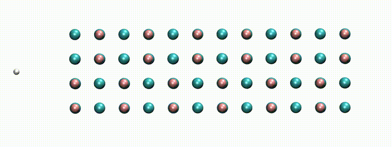

# Many-body perturbation theory for atoms, molecules, and clusters

*A swift proton in rocksalt LiF within Real-time TD-DFT [from [X. Qi et al., Phys. Rev. Lett. (2022)](http://dx.doi.org/10.1103/PhysRevLett.128.043401)]*

## MOLGW: What is it?

**MOLGW**
is a code that implements the many-body perturbation theory (MBPT) to describe the excited electronic states in finite systems (atoms, molecules, clusters).
It most importantly implements the $GW$ approximation for the self-energy and the Bethe-Salpeter equation for the optical excitations.

**MOLGW** comes with a fully functional density-functional theory (DFT) code to prepare the subsequent MBPT runs.
Standard local and semi-local approximations to DFT are available, as well as several hybrid functionals and range-separated hybrid functionals.
**MOLGW** uses a Gaussian-type orbitals basis set so to reuse all the standard quantum-chemistry tools.

With parallelization linear algebra (SCALAPACK)
**MOLGW**
can straightforwardly calculate systems containing about 100 atoms
or, in terms of basis functions, systems requiring about 2000 basis functions.
Larger calculations are of course feasible, but require large computers, lots of memory, and some patience...

## MOLGW: Who can use it?

**Anyone!**

**MOLGW** is an open-source software released under the [GNU Public License version 3.0](http://www.gnu.org/licenses/gpl.html)
And as such, **MOLGW** is completely free of charge. 
The GNU Public License offers the possibility for the user to download, compile, modify, and even redistribute the code.

## MOLGW: What can it do?

**MOLGW** is a Gaussian-Type Orbital (GTO) code for finite systems.
It implements a self-consistent mean-field calculation, followed by a many-body perturbtation theory post-treatment.

**MOLGW** can run a wide variety of popular density-functional theory approximations, including:

- LDA: PZ, PW, VWN
- GGA: BLYP, PBE, PW91, HCTH
- global hybrids: B3LYP, PBE0, BHLYP
- range-separated hybrid: HSE06, CAM-B3LYP, LC-$\omega$PBE, OTRSH, BNL
- Hartree-Fock
- Double-hybrids

**MOLGW** can calculate the electron quasiparticle energies within different flavors of the Many-body perturbation theory:

- Standard one-shot calculations: $G_0W_0$
- Eigenvalue-self-consistent calculations: ev$GW$
- Quasiparticle-Self-consistent $GW$: QS$GW$
- Static COHSEX
- Self-consistent COHSEX
- PT3, also known as Electron Propagator Theory

**MOLGW** also has some density-matrix theory features:

- linearized $GW$ density-matrix
- Natural Orbital functional Theory (NOFT)

**MOLGW** can calculate the neutral excitation energies and optical spectra within:

- Bethe-Salpeter Equation (Tamm-Dancoff Approximation or not)
- Linear-response TD-DFT (Tamm-Dancoff Approximation or not)
- Real-time TD-DFT

Incidentally, **MOLGW** can calculate the MBPT total energies within a few popular approximations:

- Random-Phase Approximation, RPAx
- MP2
- Full Configuration-Interaction for *very few* electrons

