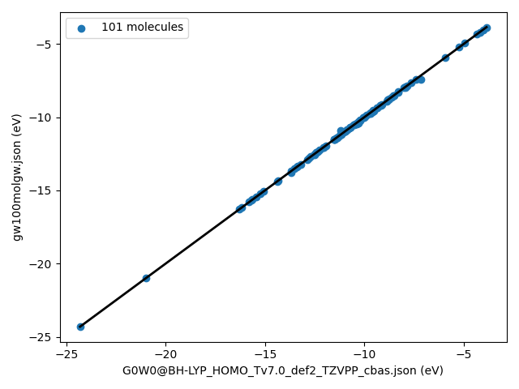
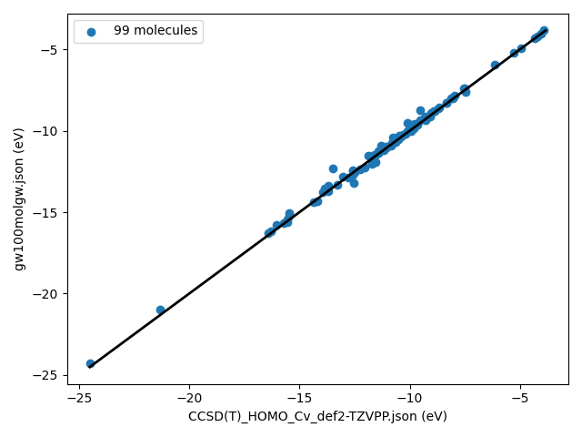

# Running a complete benchmark at once


Here we use a python script to generate many input files for **MOLGW**.
A template in python3 is given in `~molgw/utils/run_molgw.py`

Let us use the [GW100 benchmark](https://gw100.wordpress.com/) which collects the HOMO energy of 100 molecules.


# Generate the input files

The python script `run_molgw.py` runs over all the xyz files found in a folder named `structures'.

Download the structures [here](files/gw100xyz.tgz)

```sh
tar xzf gw100xyz.tgz
cp /path/to/molgw/utils/run_molgw.py .
```

Then edit the script especially here

```python
##################################################
#
# Hard-coded information
#
directory       = 'run_001'
executable      = '${HOME}/devel/molgw/molgw'
```

and here

```python
##################################################
#
# Create the calculation list here
#
ip = []
for basis in ['Def2-TZVPP']:
    ipp = collections.OrderedDict()
    ipp['basis']                   = basis
    ipp['ecp_basis']               = basis
    ipp['scf']                     = 'BHLYP'
    ipp['postscf']                 = 'G0W0'
    ipp['selfenergy_state_range']  = 3
    ipp['frozencore']              = 'yes'
    ipp['auxil_basis']             = 'AUTO'
    ipp['ecp_type']                = 'Def2-ECP'
    ipp['ecp_elements']            = 'Rb Ag I Xe'
    ip.append(ipp)
```

```sh
python3 run_molgw.py
```
generates all the input files in folder `run_001` and a bash script `run.sh` that can run all the calculations.

Besides the standard output, **MOLGW** generates a YAML formatted output that is very handy for post-processing.

Here follows a python script that lists all the `molgw.yaml` files, transforms them in a dictionary, and then retrieve the $GW$ HOMO energies.
```python
#!/usr/bin/python3
import sys, os, yaml, json
from yaml import load, Loader

########################################################################
# Hard coded directly
#
directory = 'run_001'

########################################################################
# Find all the yaml files in the directory
#
yaml_files = []
for root, dirs, files in os.walk(directory):
    for filename in files:
        if '.yaml' in filename:
            yaml_files.append(os.path.join(root, filename))
print('{} molgw.yaml files identified in directory '.format(len(yaml_files)) + directory)


########################################################################
# Read all the yaml files -> dictionary
#
calc = []
for yaml_file in yaml_files:
    with open(yaml_file, 'r') as stream:
        try:
            calc.append(load(stream,Loader=Loader))
        except:
            print(yaml_file + ' is corrupted')
            pass

########################################################################
# Analyze the dictionary
#
print('\n{:<16}   {:^9} {:^9}\n'.format('CAS number',calc[0]['input parameters']['scf'],'GW energy'))

data={}
for c in calc:
    mol =  c["input parameters"]["comment"]
    homo = int( c["physical system"]["electrons"] * 0.50 )
    homo_gks = c["gks energy"]["spin channel 1"][homo]
    try:
        homo_gw  = c["gw energy"]["spin channel 1"][homo]
        print('{:<16} {:9.3f} {:9.3f}'.format(mol,homo_gks,homo_gw))
        data[mol] = homo_gw
    except:
        print('{:<16} reading FAILED: maybe SCF cycles did not converge?'.format(mol))

########################################################################
# Create a json file
gw100molgw = dict()
gw100molgw["orbital"]= 'HOMO'
gw100molgw["remark"]= "RIJK with AUTO"
gw100molgw["code"]= "MOLGW"
gw100molgw["basis_size"]= "3" 
gw100molgw["parameters"]= { "eta": 0.001 } 
gw100molgw["basis"]= "gaussian"
gw100molgw["code_version"]= "2.E"
gw100molgw["qpe"]= "solved"
gw100molgw["DOI"]= "unpublished"
gw100molgw["basis_name"]= calc[0]["input parameters"]["basis"]
gw100molgw["calc_type"]= calc[0]["input parameters"]["postscf"] + '@' + calc[0]["input parameters"]["scf"]
gw100molgw["data"]= data

with open('gw100molgw.json', 'w') as json_file:
        json.dump(gw100molgw,json_file,indent=2,separators=(',', ': '))
```


The beginning of the output looks like
```txt
102 molgw.yaml files identified in directory run_001

CAS number           BHLYP   GW energy

7726-95-6           -8.095   -10.300
7786-30-3           -9.004   -11.267
75-02-5             -7.741   -10.231
544-92-3            -8.187   -10.016
...
```

A json file named `gw100molgw.json` is generated that can be contributed to the official GW100 web site.

Conversely one can retrieve files from GW100 github repository:
```sh
wget https://raw.githubusercontent.com/setten/GW100/master/data/G0W0%40BH-LYP_HOMO_Tv7.0_def2_TZVPP_cbas.json
wget https://raw.githubusercontent.com/setten/GW100/master/data/CCSD\(T\)_HOMO_Cv_def2-TZVPP.json
```

and compare them with our results
```py
#!/usr/bin/python3
import sys, os, yaml, json
import matplotlib.pyplot as plt

if len(sys.argv) > 2:
    files = sys.argv[1:3]
else:
    print('please specify two json files')
    sys.exit(1)

sets = []
for file in files:
    with open(file, 'r') as stream:
        try:
            sets.append(json.load(stream))
        except:
            print(file + ' is corrupted')
            pass

e1 = []
e2 = []
for mol in sets[0]["data"].keys():
   try:
      e1.append(float(sets[0]["data"][mol]))
      e2.append(float(sets[1]["data"][mol]))
   except:
      pass

xymin=min(e1+e2)
xymax=max(e1+e2)
plt.xlabel(files[0] + ' (eV)')
plt.ylabel(files[1] + ' (eV)')
plt.plot([xymin,xymax],[xymin,xymax],'-',color='black',lw=2.0)
plt.scatter(e1, e2,label='{} molecules'.format(len(e1)))
plt.legend()
plt.tight_layout()
plt.show()
```




