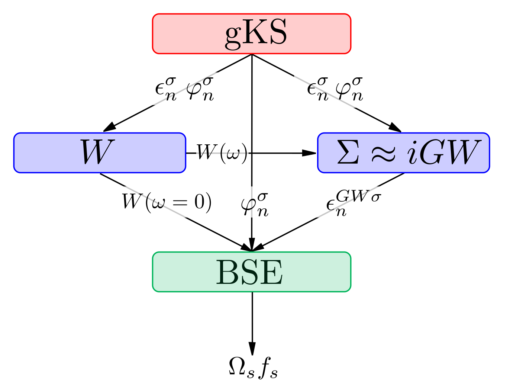
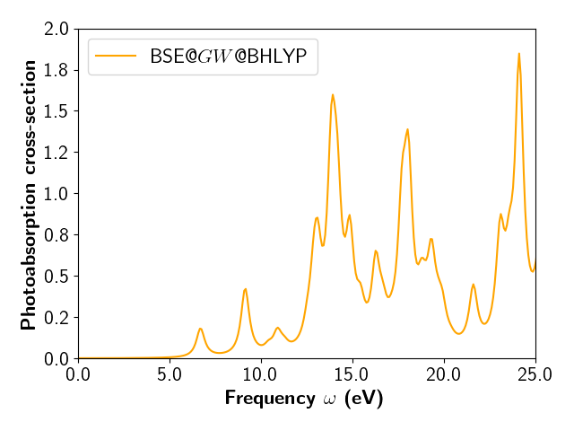

# Bethe-Salpeter Equation



This is the typical "one-shot" BSE workflow.

Let's how **MOLGW** does all this in just 2 runs.


## First run

First thing first: a $GW$ calculation for all the states:
```fortran
&molgw
  comment='H2O GW for all the states'

  scf='BHLYP'

  basis='aug-cc-pVTZ'
  auxil_basis='aug-cc-pVTZ-RI'

  postscf='G0W0'

  frozencore='yes'

  natom=3
/
O      0.000000  0.000000  0.119262
H      0.000000  0.763239 -0.477047 
H      0.000000 -0.763239 -0.477047 
```

This produces the `ENERGY_QP` file that will be read in the next BSE run.


## Second run

The BSE diagonalization itself:
```fortran
&molgw
  comment='H2O BSE'

  scf='BHLYP'
  read_restart='yes'    ! read the RESTART file so to skip the DFT part
                        ! just to save time

  basis='aug-cc-pVTZ'
  auxil_basis='aug-cc-pVTZ-RI'

  postscf='bse'

  frozencore='yes'

  eta=0.01              ! Broadening of 0.27 eV for the optical spectrum

  natom=3
/
O      0.000000  0.000000  0.119262
H      0.000000  0.763239 -0.477047 
H      0.000000 -0.763239 -0.477047 
```

In the output, we obtain a list of optical excitations with their energies
and their oscillator strengths:

```text
 Calculate the optical spectrum

     Excitation energies (eV)     Oscil. strengths   [Symmetry] 
 Exc. 0001 :         6.70459787          0.03810771       1(A2, B1 or App)                
           5 ->    6     -0.61869
           5 ->    8      0.27268
           5 ->   10      0.17432
           5 ->   18      0.10570

 Exc. 0002 :         8.46893511          0.00000000       1(A2, B1 or App)                
           5 ->    7      0.56126
           5 ->   11      0.38831
           5 ->   12      0.12294
           5 ->   19      0.13325

 Exc. 0003 :         9.14756408          0.08897298       1(A1, B2 or Ap )                
           4 ->    6     -0.62009
           4 ->    8      0.23204
           4 ->   10      0.19474
           5 ->    9     -0.10885

 Exc. 0004 :        10.42700059          0.00803746       1(A2, B1 or App)                
           5 ->    6      0.16101
           5 ->    8      0.55075
           5 ->   10     -0.36243
           5 ->   16      0.17142
```

A file named `photoabsorption_cross_section.dat` is produced.
It contains the photoabsorption cross-section tensor, often written $\alpha_{xy}(\omega)$.

Let us plot the second column that contains the Trace of the tensor.




