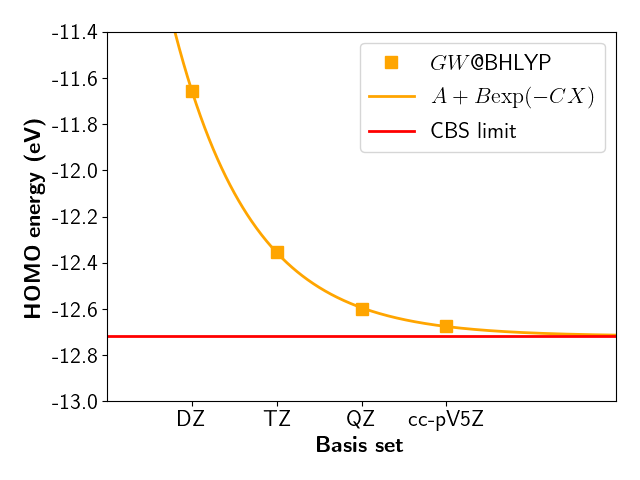

# GW with fully analytic formula (general)

Here follows the most standard $GW$ calculation with MOLGW for the ionization potential (IP) of water.
$G_0W_0$ based on BHLYP (50 %) of exact-exchange is known to be very good for IPs.

```fortran
&molgw
  comment='H2O GW analytic formula'    ! an optional plain text here

  scf='BHLYP'

  basis='cc-pVTZ'
  auxil_basis='cc-pVTZ-RI'

  postscf='G0W0'

  selfenergy_state_range=0      ! will calculate just the HOMO
  frozencore='yes'              ! accurate approximation: O1s will not be included 
                                ! in the RPA/GW calculation

  natom=3
/
O      0.000000  0.000000  0.119262
H      0.000000  0.763239 -0.477047 
H      0.000000 -0.763239 -0.477047 
```

After the SCF cycles with the BHLYP hybrid functinal, one can find the response calculation within the RPA equation:
```text
 Prepare a polarizability spectral function with
                               Occupied states:        4
                                Virtual states:       53
                              Transition space:      212
```

MOLGW will then diagonalize a $212 \times 212$ matrix. This is must often the computational bottleneck in a calculation.
Memory scales as $N^4$ and computer time as $N^6$.

Then comes the $GW$ quasiparticle energies and weights:
```text
 state spin    QP energy (eV)  QP spectral weight
     5    1     -12.354761       0.915241
```

State 5 is the HOMO. The $GW$ ionization potential is the negative HOMO, here 12.35 eV.

Experimental value is [12.62 eV](https://webbook.nist.gov/cgi/cbook.cgi?ID=C7732185&Mask=20#Ion-Energetics)

The discrepancy is large. Why?


## GW slow convergence

A complete basis convergnce study for GW@BHLYP would give


with a CBS HOMO evaluated to -12.72 eV.


MOLGW automatically proposes a CBS extrapolated value based a *trained* linear regression:
```text
 Extrapolation to CBS (eV)
                         <i|-\nabla^2/2|i>    Delta E_i     E_i(cc-pVTZ)      E_i(CBS)
 state    5 spin  1 :        62.271159       -0.404451      -12.354761      -12.759212
```
where the $GW$ HOMO energy is -12.76 eV. So 0.04 eV away from the correct CBS, but the raw cc-pVTZ value was 0.37 eV away.

Now the experimental and $GW$ IP agree within 0.14 eV.
This is the typical accuracy of $GW$ calculations.


# GW with imaginary frequencies (HOMO LUMO gap)

If we are just interested in the HOMO LUMO region, there exists an alternative to the fully
diagonalization of the RPA equation ($N^6$ scaling).

The $GW$ self-energy can be evaluated by numerical quadruture for imaginary frequencies and then
analytically continued to  real frequencies with a Padé approximant.

This is much faster ($N^4$ scaling), however it is robust only in the HOMO-LUMO gap region and it requires more convergence parameters.

Here is a typical input file:
```fortran
&molgw
  comment='H2O GW with numerical integration'

  scf='BHLYP'

  basis='cc-pVTZ'
  auxil_basis='cc-pVTZ-RI'

  postscf='G0W0_PADE'

  selfenergy_state_range=0
  frozencore='yes'

  nomega_chi_imag=16           ! frequency grid for the response function
  nomega_sigma_calc=12         ! frequency grid for sigma along the imaginary axis 
                               ! (fit of the analytic continuation)
  step_sigma_calc=0.1           
  nomega_sigma=101             ! frequency grid for sigma along the real axis

  natom=3
/
O      0.000000  0.000000  0.119262 
H      0.000000  0.763239 -0.477047 
H      0.000000 -0.763239 -0.477047 
```

The output reports a HOMO value of -12.354 eV, which agrees within 1 meV with the previous analytic value.
```text
 state spin    QP energy (eV)  QP spectral weight
     5    1     -12.354356       0.915308
```

